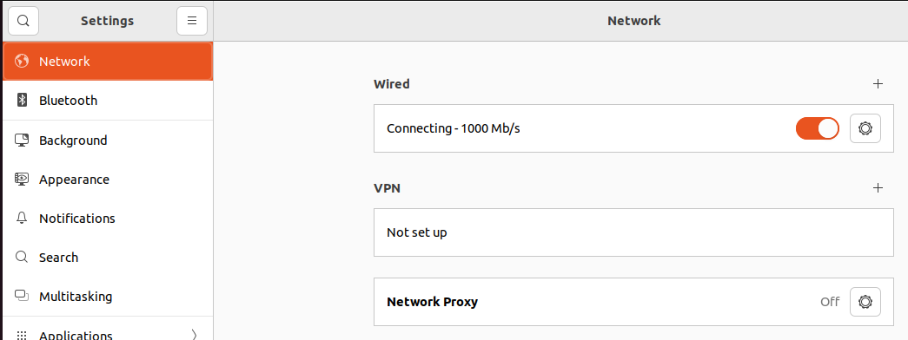

# prj-network

Este proyecto pretende mostrar el conocimiento en redes que he acumulado a lo largo de los years.

Will exist too much text wrote on english or spanish, de alguna manera esto es spanglish.

# Conexion de dos computadores

Ok empecemos lo primero es crear la conexion entre dos computadores asi que vamos a hacerlo entre dos maquinas virtuales esto por ejemplificar un entorno casi real.

> **NOTE:** Antes de esto es necesario que conozcas o hayas creado una maquina virtual si este conocimiento no es parte ahora de ti es mejor que lo aprendas antes de continuar.

Bueno si has decidido continuar te comento que estoy usando virtualbox en su version, solo una recomendacion es mejor tener algo de ram para trabajar de mejor manera.

## Windows 11 configuration

La maquina virtuall esta configurada de la siguiente manera

Antes de encender nos toca confgurar la red de virtualbox por el cual solo estas dos maquinas se conectarán.

### Network configuration

Haciendole ping a ubuntu

## Ubuntu 24.04 configuration

### Network configuration

Hay que confesar que primero deberias validar si tienes un internet que supere los 200 mbps, ya que entre instalar una maquina virtual y la otra facilmente se me ha ido una media tarde y recordando que esto es muy valioso vamos ahora a utilizar vagrant o ansible para poder crear maquinas virtuales tanto de ubuntu como de windows en sus versiones workstation para que estos despliegues  puedan llevarse en paralelo.
